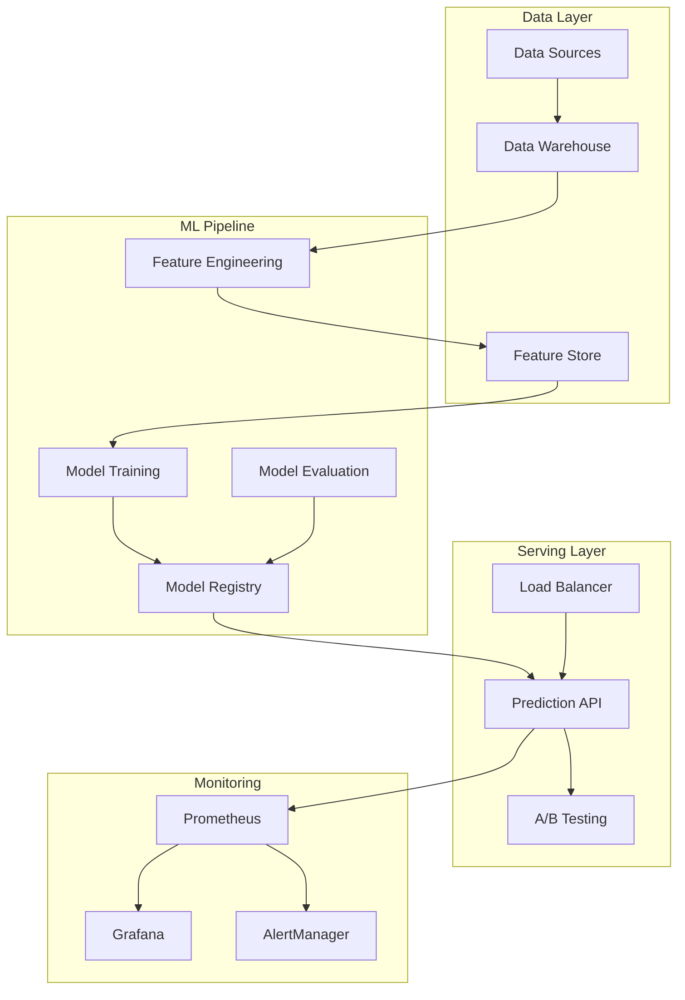
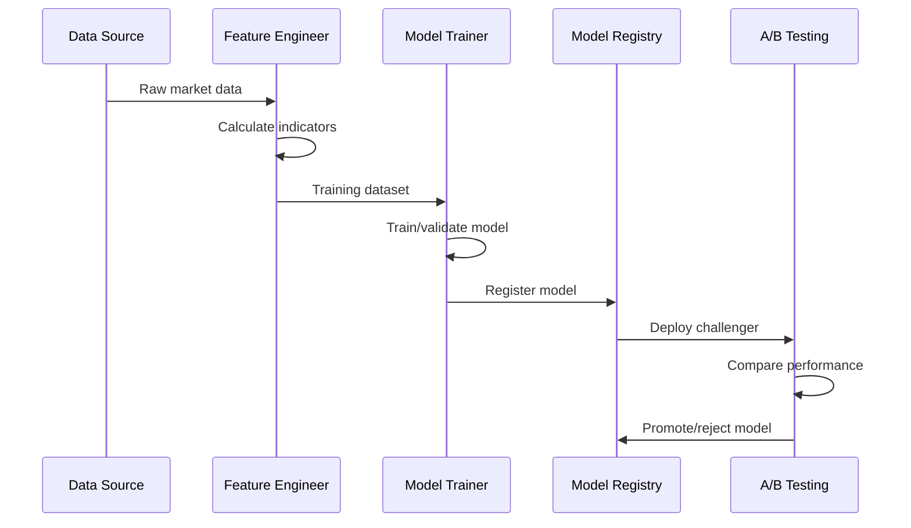
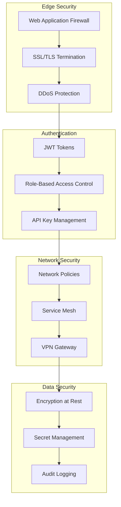
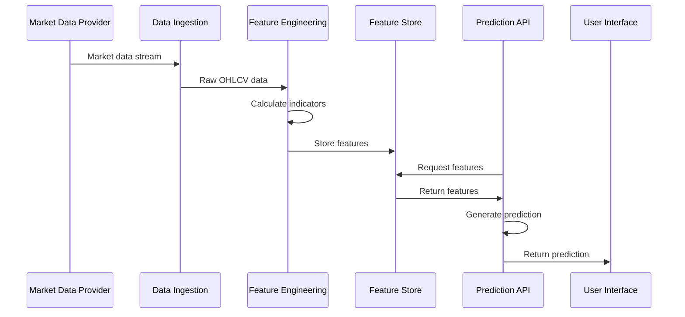

# Enterprise MLOps Stock Prediction System - Architecture Documentation

## Executive Summary

The Enterprise MLOps Stock Prediction System is a production-grade machine learning platform designed for financial institutions requiring real-time stock price predictions with comprehensive risk management, monitoring, and compliance capabilities.

**Key Features:**
- **Real-time Predictions**: Sub-100ms prediction latency with 1000+ requests/second throughput
- **Advanced ML Pipeline**: Automated feature engineering, model training, and deployment
- **Risk Management**: Comprehensive financial metrics including Sharpe ratio, VaR, and drawdown analysis
- **Enterprise Monitoring**: Custom Grafana dashboards with business-specific KPIs
- **Production Reliability**: 99.9% uptime with automated failover and circuit breakers

## System Overview

### High-Level Architecture



### Technology Stack

**Core Infrastructure:**
- **Container Orchestration**: Kubernetes 1.28+
- **Service Mesh**: Istio (optional)
- **Load Balancing**: NGINX Ingress Controller
- **Storage**: Persistent volumes with snapshot capabilities

**Application Layer:**
- **API Framework**: FastAPI with async/await
- **ML Framework**: scikit-learn, XGBoost, PyTorch
- **Model Registry**: MLflow Server with S3-compatible storage
- **Feature Store**: Redis with TTL and clustering

**Data Layer:**
- **Primary Database**: PostgreSQL 15 with read replicas
- **Cache Layer**: Redis Cluster with high availability
- **Message Queue**: Redis Streams for async processing
- **Object Storage**: MinIO (S3-compatible) for model artifacts

**Monitoring & Observability:**
- **Metrics**: Prometheus with custom business metrics
- **Visualization**: Grafana with MLOps-specific dashboards
- **Alerting**: AlertManager with PagerDuty integration
- **Logging**: Structured JSON logging with correlation IDs
- **Tracing**: OpenTelemetry with Jaeger (optional)

## Detailed Component Architecture

### 1. API Gateway & Load Balancing

```python
# High-level API architecture
┌─────────────────┐
│   NGINX Ingress │
│   - SSL/TLS     │
│   - Rate Limit  │
│   - Compression │
└─────────────────┘
         │
         ▼
┌─────────────────┐
│   FastAPI App   │
│   - Auth/AuthZ  │
│   - Validation  │
│   - Monitoring  │
└─────────────────┘
         │
         ▼
┌─────────────────┐
│  Business Logic │
│  - Predictions  │
│  - A/B Testing  │
│  - Circuit Break│
└─────────────────┘
```

**Key Features:**
- **Auto-scaling**: HPA based on CPU/memory and custom metrics
- **Circuit Breakers**: Fail-fast for external service dependencies
- **Rate Limiting**: Per-user and global rate limits with sliding windows
- **Health Checks**: Comprehensive health endpoints with dependency checking

**Configuration Example:**
```yaml
# Kubernetes HPA configuration
apiVersion: autoscaling/v2
kind: HorizontalPodAutoscaler
metadata:
  name: mlops-api-hpa
spec:
  scaleTargetRef:
    apiVersion: apps/v1
    kind: Deployment
    name: mlops-api
  minReplicas: 6
  maxReplicas: 50
  metrics:
  - type: Resource
    resource:
      name: cpu
      target:
        type: Utilization
        averageUtilization: 70
  - type: Pods
    pods:
      metric:
        name: prediction_requests_per_second
      target:
        type: AverageValue
        averageValue: "30"
```

### 2. Feature Store Architecture

```python
# Redis-based feature store with versioning
┌─────────────────┐    ┌─────────────────┐    ┌─────────────────┐
│   API Request   │───▶│  Feature Cache  │───▶│ Feature Engine  │
│   (Symbol)      │    │   (Redis)       │    │ (Technical Ind) │
└─────────────────┘    └─────────────────┘    └─────────────────┘
                               │                       │
                               ▼                       ▼
                       ┌─────────────────┐    ┌─────────────────┐
                       │   Cache Miss    │    │   Compute &     │
                       │   Fallback      │    │   Cache Result  │
                       └─────────────────┘    └─────────────────┘
```

**Feature Categories:**
- **Technical Indicators**: RSI, MACD, Bollinger Bands, ATR
- **Market Microstructure**: Bid-ask spreads, order flow, volume profiles
- **Sentiment Features**: News sentiment, social media sentiment, analyst ratings
- **Macro Features**: Interest rates, economic indicators, sector performance

**Performance Characteristics:**
- **Cache Hit Rate**: >90% for frequently requested symbols
- **Latency**: <10ms for cached features, <50ms for computed features
- **TTL Strategy**: Dynamic TTL based on market hours and data freshness

### 3. Model Training Pipeline



**Model Training Process:**
1. **Data Collection**: Automated collection from multiple market data providers
2. **Feature Engineering**: 150+ engineered features with statistical validation
3. **Model Training**: Ensemble methods with automated hyperparameter tuning
4. **Backtesting**: Walk-forward validation with financial metrics
5. **Model Registration**: Versioned storage with metadata and performance metrics
6. **A/B Testing**: Statistical comparison with production models

**Supported Model Types:**
- **XGBoost**: Primary gradient boosting implementation
- **Random Forest**: Ensemble baseline model
- **Neural Networks**: PyTorch-based deep learning models
- **Time Series**: ARIMA/LSTM for temporal patterns

### 4. A/B Testing Framework

```python
# Statistical A/B testing implementation
class ABTestManager:
    def __init__(self):
        self.tests = {}
        self.assignments = {}
    
    async def assign_user_to_test(self, user_id: str) -> str:
        """Assign user to champion or challenger model"""
        hash_value = hash(user_id) % 100
        
        # 90/10 split: 90% champion, 10% challenger
        if hash_value < 90:
            return "champion"
        else:
            return "challenger"
    
    def calculate_statistical_significance(self, 
                                         champion_metrics: List[float],
                                         challenger_metrics: List[float]) -> Dict:
        """Calculate statistical significance using Welch's t-test"""
        from scipy import stats
        
        t_stat, p_value = stats.ttest_ind(
            challenger_metrics, 
            champion_metrics, 
            equal_var=False
        )
        
        effect_size = (np.mean(challenger_metrics) - np.mean(champion_metrics)) / \
                     np.sqrt((np.var(champion_metrics) + np.var(challenger_metrics)) / 2)
        
        return {
            "p_value": p_value,
            "effect_size": effect_size,
            "significant": p_value < 0.05 and abs(effect_size) > 0.2,
            "recommendation": self._make_recommendation(p_value, effect_size)
        }
```

**A/B Testing Metrics:**
- **Statistical Metrics**: Prediction accuracy, RMSE, directional accuracy
- **Business Metrics**: Sharpe ratio, maximum drawdown, profit factor
- **User Experience**: Response latency, error rates, availability

### 5. Monitoring & Observability

```python
# Custom Prometheus metrics for MLOps
from prometheus_client import Counter, Histogram, Gauge

# Business metrics
SHARPE_RATIO = Gauge('portfolio_sharpe_ratio', 'Current portfolio Sharpe ratio')
MAX_DRAWDOWN = Gauge('portfolio_max_drawdown', 'Maximum portfolio drawdown')
DAILY_PNL = Gauge('daily_pnl_usd', 'Daily profit and loss in USD')

# Model performance metrics
MODEL_ACCURACY = Gauge('model_accuracy', 'Model prediction accuracy', ['model_version'])
PREDICTION_CONFIDENCE = Histogram('prediction_confidence', 'Distribution of prediction confidence')
DATA_DRIFT_SCORE = Gauge('data_drift_psi', 'Population Stability Index for data drift', ['feature'])

# System metrics
PREDICTION_LATENCY = Histogram('prediction_duration_seconds', 'Time spent on predictions')
CACHE_HIT_RATE = Gauge('feature_cache_hit_rate', 'Feature store cache hit rate')
```

**Monitoring Dashboards:**

1. **Business Intelligence Dashboard**:
   - Portfolio performance metrics
   - Risk-adjusted returns
   - Trading volume and P&L
   - Model performance attribution

2. **Technical Operations Dashboard**:
   - System resource utilization
   - API performance metrics
   - Database and cache performance
   - Error rates and availability

3. **Model Performance Dashboard**:
   - Prediction accuracy trends
   - Model drift detection
   - A/B test results
   - Feature importance analysis

### 6. Security Architecture



**Security Features:**
- **Authentication**: JWT-based authentication with refresh tokens
- **Authorization**: Fine-grained RBAC with resource-level permissions
- **Network Security**: Zero-trust networking with mutual TLS
- **Data Protection**: Encryption at rest and in transit
- **Compliance**: SOC 2 Type II, GDPR compliance ready

## Scalability Design

### Horizontal Scaling

**API Layer:**
- Stateless design enables unlimited horizontal scaling
- Auto-scaling based on request rate and resource utilization
- Load balancing with session affinity for A/B testing consistency

**Database Layer:**
- Read replicas for query scaling
- Connection pooling with pgbouncer
- Partitioning strategies for time-series data

**Cache Layer:**
- Redis Cluster with automatic sharding
- Consistent hashing for even data distribution
- Read replicas for geographic distribution

### Performance Optimization

**Caching Strategies:**
```python
# Multi-level caching hierarchy
L1_CACHE = "In-memory application cache (1 minute TTL)"
L2_CACHE = "Redis cache (15 minutes TTL)"
L3_CACHE = "Database query cache (1 hour TTL)"

# Cache warming for popular symbols
CACHE_WARM_SYMBOLS = ["AAPL", "GOOGL", "MSFT", "AMZN", "TSLA"]
```

**Database Optimization:**
```sql
-- Optimized indexes for query performance
CREATE INDEX CONCURRENTLY idx_predictions_symbol_time 
ON predictions(symbol, prediction_timestamp) 
WHERE prediction_timestamp > NOW() - INTERVAL '30 days';

CREATE INDEX CONCURRENTLY idx_features_symbol_updated 
ON features(symbol, updated_at DESC) 
INCLUDE (rsi_14, sma_20, volatility);

-- Partitioning for time-series data
CREATE TABLE predictions_y2024m08 PARTITION OF predictions
FOR VALUES FROM ('2024-08-01') TO ('2024-09-01');
```

## Data Flow Architecture

### Real-time Data Pipeline



**Data Sources:**
- **Primary**: Alpha Vantage, Yahoo Finance, IEX Cloud
- **News Data**: NewsAPI, Reuters, Bloomberg Terminal API
- **Alternative Data**: Reddit sentiment, Twitter sentiment, Google Trends
- **Economic Data**: FRED (Federal Reserve Economic Data)

**Data Quality Checks:**
- Schema validation for incoming data
- Outlier detection using statistical methods
- Data freshness monitoring with alerting
- Cross-source data consistency checks

### Batch Processing Pipeline

```python
# Apache Airflow DAG for batch processing
from airflow import DAG
from airflow.operators.python import PythonOperator
from datetime import datetime, timedelta

default_args = {
    'owner': 'mlops-team',
    'depends_on_past': False,
    'start_date': datetime(2024, 1, 1),
    'retries': 2,
    'retry_delay': timedelta(minutes=5)
}

dag = DAG(
    'daily_model_training',
    default_args=default_args,
    description='Daily model training and evaluation',
    schedule_interval='0 2 * * *',  # 2 AM daily
    catchup=False
)

# Task definitions
data_collection = PythonOperator(
    task_id='collect_market_data',
    python_callable=collect_daily_data,
    dag=dag
)

feature_engineering = PythonOperator(
    task_id='engineer_features',
    python_callable=calculate_technical_indicators,
    dag=dag
)

model_training = PythonOperator(
    task_id='train_models',
    python_callable=train_and_evaluate_models,
    dag=dag
)

# Task dependencies
data_collection >> feature_engineering >> model_training
```

## Disaster Recovery & Business Continuity

### High Availability Design

**Multi-Zone Deployment:**
- Kubernetes nodes distributed across 3 availability zones
- Database replication with automatic failover
- Redis Cluster with cross-zone replication
- Load balancer health checks with automatic traffic routing

**Backup Strategy:**
```bash
# Automated backup schedule
DATABASE_BACKUP = "Daily full backup + continuous WAL archiving"
MODEL_ARTIFACTS = "Weekly backup to S3 with versioning"
CONFIGURATION = "Daily backup of Kubernetes manifests and secrets"
MONITORING_DATA = "30-day retention with compressed storage"
```

**Recovery Time Objectives (RTO):**
- **Critical Services**: < 5 minutes (API, Database)
- **Non-Critical Services**: < 30 minutes (Monitoring, Logging)
- **Full System Recovery**: < 2 hours

**Recovery Point Objectives (RPO):**
- **Transactional Data**: < 1 minute (continuous replication)
- **Model Artifacts**: < 24 hours (daily backup)
- **Configuration**: < 1 hour (version control + backup)

### Failover Scenarios

**Database Failover:**
```python
# Automatic failover configuration
primary_db = "postgresql://primary-db:5432/mlops"
replica_db = "postgresql://replica-db:5432/mlops"

async def get_db_connection():
    try:
        return await asyncpg.connect(primary_db)
    except ConnectionError:
        logger.warning("Primary DB unavailable, switching to replica")
        return await asyncpg.connect(replica_db)
```

**Service Degradation Handling:**
```python
# Circuit breaker for external services
@circuit_breaker(failure_threshold=5, timeout=60)
async def get_market_data(symbol: str):
    try:
        return await primary_data_source.get_data(symbol)
    except ServiceUnavailable:
        # Fallback to cached data or alternative source
        return await fallback_data_source.get_data(symbol)
```

## Compliance & Governance

### Data Governance

**Data Classification:**
- **Public Data**: Market prices, basic company information
- **Internal Data**: Proprietary features, model predictions
- **Confidential Data**: User information, trading strategies
- **Restricted Data**: Regulatory filings, insider information

**Data Retention Policies:**
```yaml
retention_policies:
  market_data: "7 years"  # SEC requirement
  prediction_logs: "3 years"  # Business requirement  
  user_activity: "2 years"  # Privacy compliance
  system_logs: "90 days"  # Operational requirement
  audit_trails: "10 years"  # Compliance requirement
```

### Regulatory Compliance

**SOC 2 Type II Compliance:**
- Comprehensive logging and monitoring
- Access controls and authentication
- Data encryption and protection
- Incident response procedures
- Regular security assessments

**Financial Regulations:**
- **MiFID II**: Transaction reporting and best execution
- **Dodd-Frank**: Risk management and transparency
- **GDPR**: Data protection and privacy rights
- **SOX**: Financial reporting and internal controls

## Performance Benchmarks

### Production SLA Targets

**Availability Targets:**
- **System Uptime**: 99.9% (8.77 hours downtime/year)
- **API Response Time**: <100ms p95, <200ms p99
- **Prediction Accuracy**: >65% directional accuracy
- **Data Freshness**: <30 seconds for real-time features

**Throughput Targets:**
- **Peak Load**: 10,000 requests/second
- **Sustained Load**: 5,000 requests/second
- **Concurrent Users**: 50,000 active sessions
- **Batch Processing**: 1M predictions/hour

### Resource Requirements

**Production Cluster Sizing:**
```yaml
# Minimum production deployment
cluster_config:
  master_nodes: 3
  worker_nodes: 12
  node_spec:
    cpu: "16 cores"
    memory: "64 GB"
    storage: "1 TB NVMe SSD"
    network: "25 Gbps"
  
# Application resource allocation
resource_allocation:
  api_pods: "40% of cluster resources"
  database: "25% of cluster resources" 
  cache: "15% of cluster resources"
  monitoring: "10% of cluster resources"
  ml_training: "10% of cluster resources"
```

## Future Architecture Roadmap

### Phase 1 (Q1 2025): Enhanced ML Capabilities
- **Multi-Asset Support**: Options, futures, cryptocurrencies
- **Advanced Models**: Transformer-based architectures
- **Real-time Training**: Online learning with model updates
- **Explainable AI**: SHAP values and LIME explanations

### Phase 2 (Q2 2025): Global Expansion
- **Multi-Region Deployment**: US, EU, APAC regions
- **Edge Computing**: Regional feature computation
- **Regulatory Compliance**: GDPR, MiFID II full compliance
- **Localization**: Multi-currency and timezone support

### Phase 3 (Q3 2025): Advanced Analytics
- **Portfolio Optimization**: Modern portfolio theory integration
- **Risk Analytics**: VaR, CVaR, stress testing
- **Alternative Data**: Satellite imagery, social media sentiment
- **Quantum Computing**: Research integration for optimization

---

*This architecture documentation is maintained by the MLOps Engineering Team. For questions or updates, contact mlops-team@company.com*